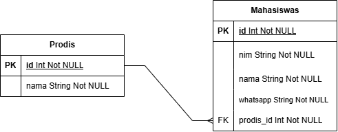

# Dashboard Mahasiswa

Proyek ini adalah sebuah Dashboard Mahasiswa yang dirancang untuk mengelola data mahasiswa dan program studi (prodi) dalam sistem yang terintegrasi. Aplikasi ini memungkinkan pengguna untuk melakukan operasi CRUD (Create, Read, Update, Delete) pada dua tabel yang saling berhubungan, yaitu tabel mahasiswa dan tabel prodi.

## About 
## Skema Database

Skema database proyek ini terdiri dari dua tabel utama:

1. **Tabel `mahasiswa`**: Menyimpan informasi tentang mahasiswa.
   - `id`: Primary key, auto-increment
   - `nim`: String, nim mahasiswa
   - `name`: String, nama mahasiswa
   - `whatsapp`: String, whatsapp mahasiswa
   - `prodi_id`: Foreign key, merujuk ke tabel `prodi`

2. **Tabel `prodi`**: Menyimpan informasi tentang program studi.
   - `id`: Primary key, auto-increment
   - `nama`: String, nama program studi

Hubungan antar tabel:
- Tabel `mahasiswa` memiliki kolom `prodi_id` yang merujuk ke `id` di tabel `prodi`, membentuk relasi one-to-many (satu prodi dapat memiliki banyak mahasiswa).

## Gambar Skema Database



<p align="center">
  
</p>

## Features

- **Manajemen Data Mahasiswa**: Pengguna dapat menambahkan, melihat, mengedit, dan menghapus data mahasiswa. Setiap mahasiswa dapat dihubungkan dengan program studi yang relevan.
- **Manajemen Data Program Studi**: Pengguna juga dapat mengelola data program studi, termasuk menambahkan program baru, memperbarui informasi yang ada, dan menghapus program studi yang tidak lagi digunakan.
- **Relasi Antara Tabel**: Terdapat relasi yang jelas antara tabel mahasiswa dan tabel prodi, sehingga pengguna dapat dengan mudah melihat program studi yang diambil oleh setiap mahasiswa.e
- **Validasi Input**: Setiap data yang dimasukkan ke dalam sistem akan melalui proses validasi untuk memastikan bahwa data yang disimpan adalah akurat dan konsisten.
- **Antarmuka Pengguna yang Intuitif**: Dashboard dilengkapi dengan antarmuka pengguna yang ramah, membuat navigasi antara fitur-fitur menjadi mudah dan efisien.


## Requirements
- Laravel 8
- php 7.3 - 8.1
- Composer
- Database MySQL

## Installation

1. Ikuti langkah-langkah berikut untuk menginstal proyek ini:

```bash
  git clone https://github.com/RahmatPrakoso276/crud-mhs-dot.git
```
2. Masuk ke direktori proyek
```
cd repo-name
```

3. Install dependensi
```
composer install
```

4. Salin file .env.example ke aplikasi
```
cp .env.example .env
```
5. Generate key
```
php artisan key:generate
```
6. Konfigurasikan .env sesuaikan dengan settingan database anda
7. Jalankan Migrasi 
```
php artisan migrate
```
8. Jalankan aplikasi
```
php artisan serve
```
    
